# RWA Prime - System Diagrams

This document contains all Mermaid diagrams for visualizing the RWA Prime architecture, data flows, and processes.

---

## Table of Contents
1. [System Architecture](#system-architecture)
2. [Data Flow Diagrams](#data-flow-diagrams)
3. [Database Schema](#database-schema)
4. [API Sequence Diagrams](#api-sequence-diagrams)
5. [Deployment Architecture](#deployment-architecture)
6. [User Flows](#user-flows)

---

## System Architecture

### High-Level System Architecture

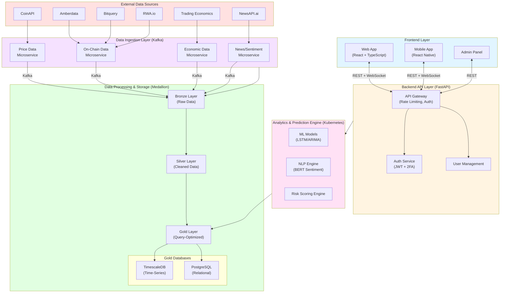

### Medallion Data Architecture

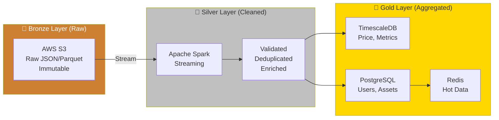

---

## Data Flow Diagrams

### Real-Time Price Update Flow

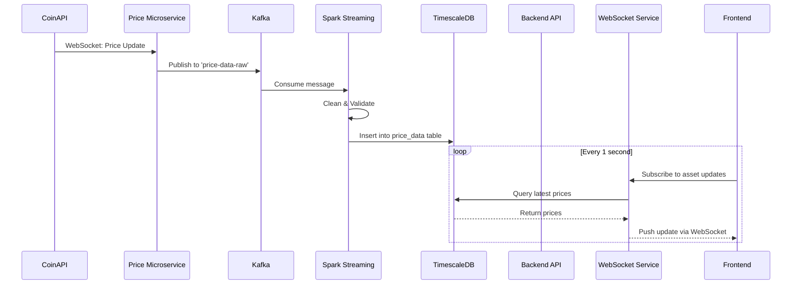

### ML Prediction Generation Flow

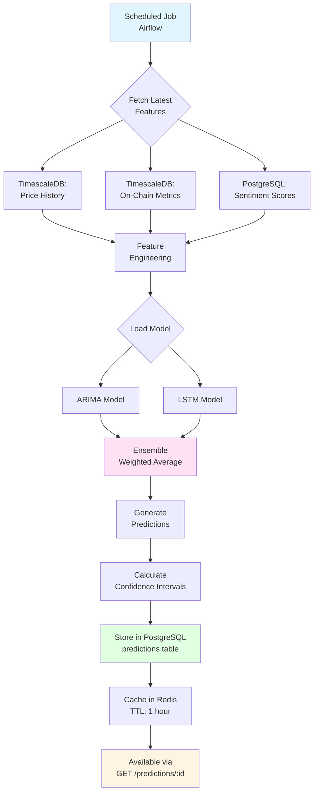

### User Alert Trigger Flow

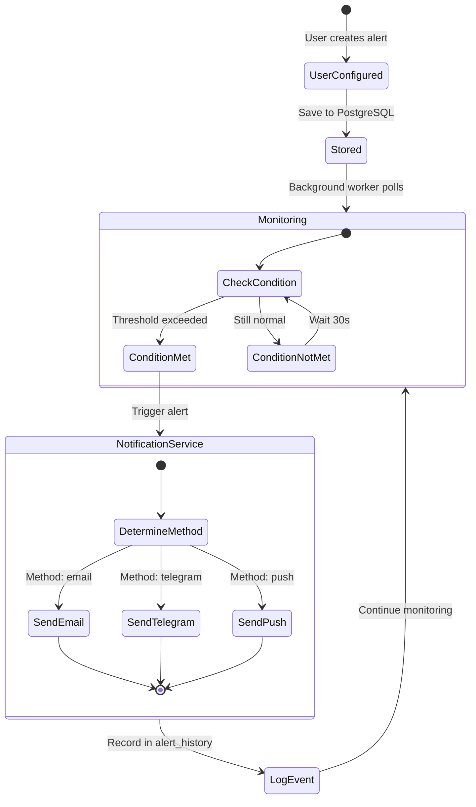

---

## Database Schema

### Core Entity Relationship Diagram

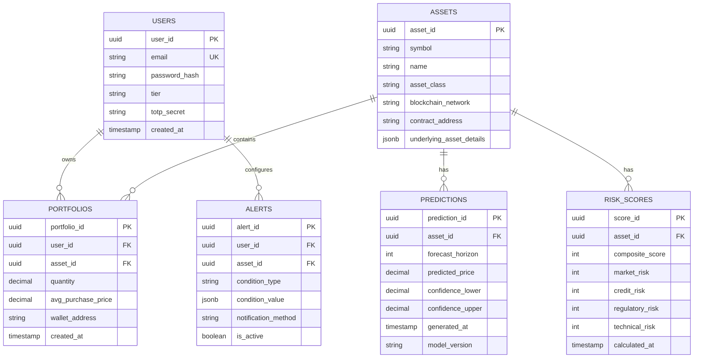

### Time-Series Data Model

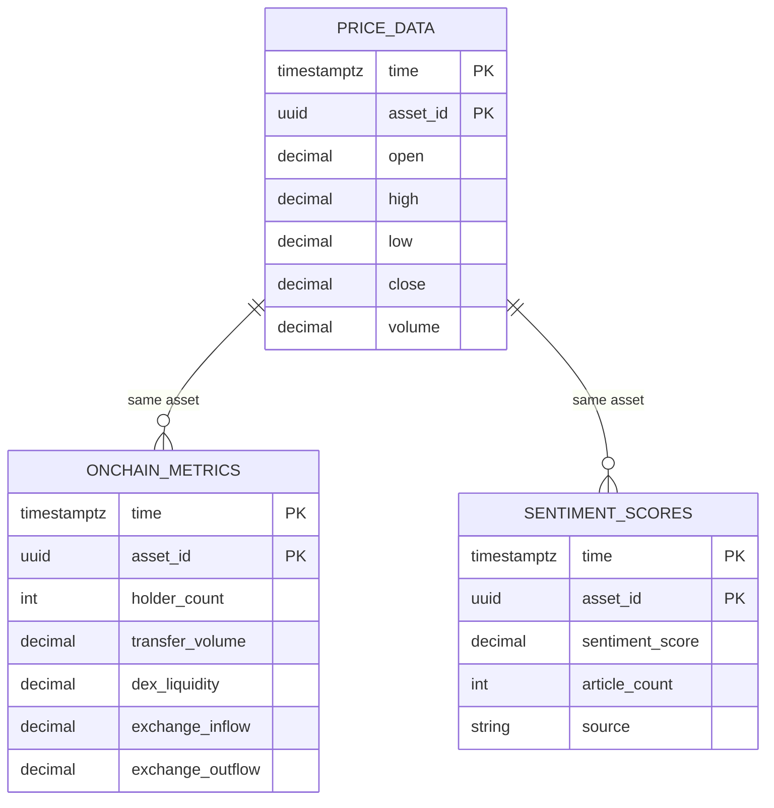

---

## API Sequence Diagrams

### User Authentication Flow (with 2FA)

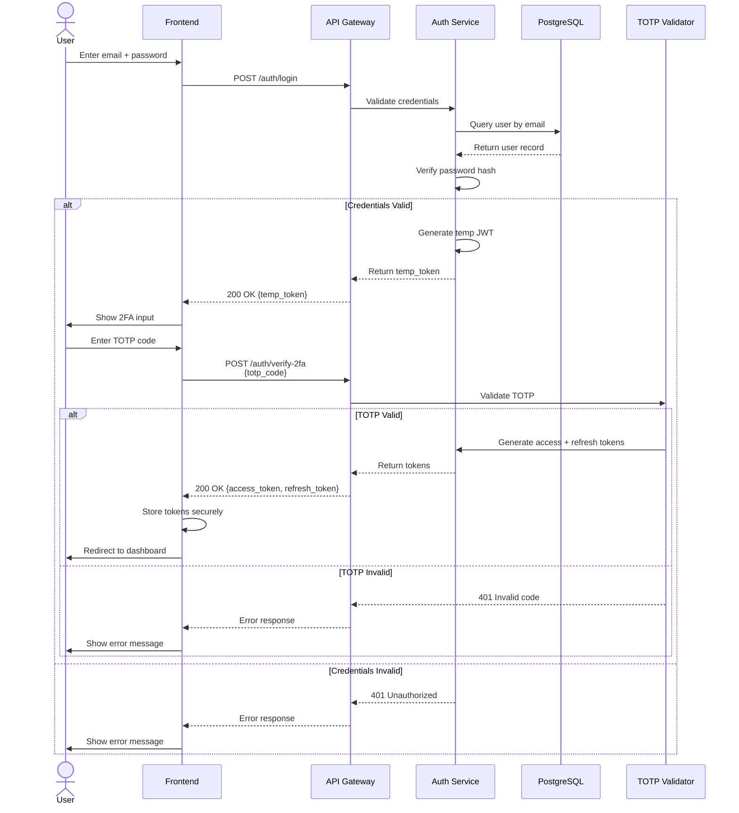

### Portfolio Sync from Wallet

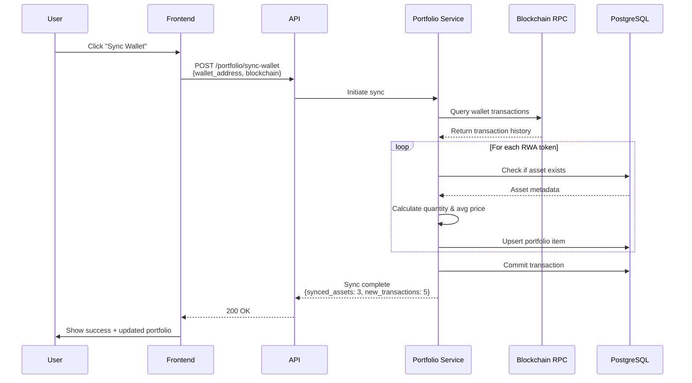

### Prediction Request Flow

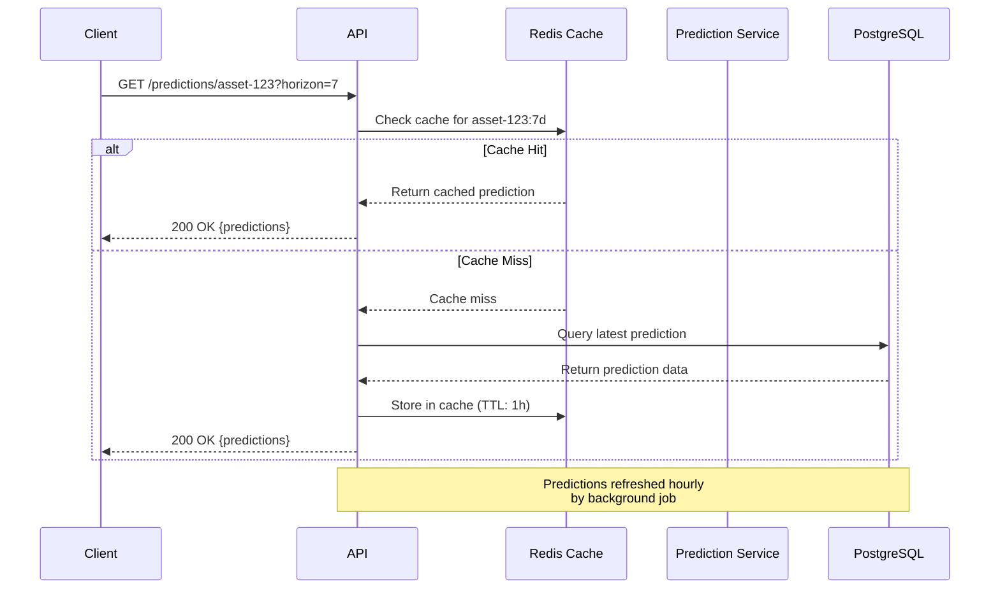

---

## Deployment Architecture

### Kubernetes Cluster Architecture

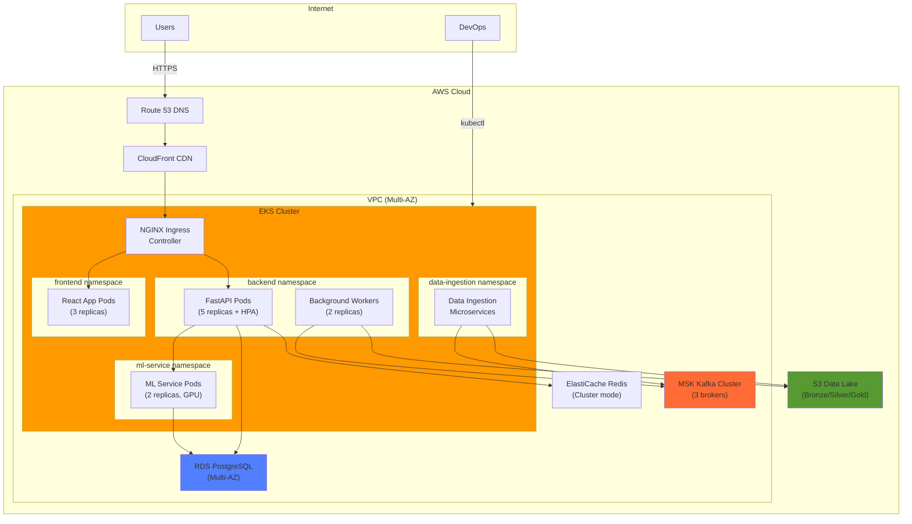

### Multi-Environment Strategy

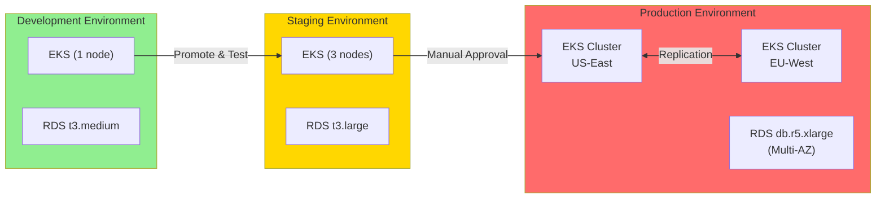

---

## User Flows

### New User Onboarding

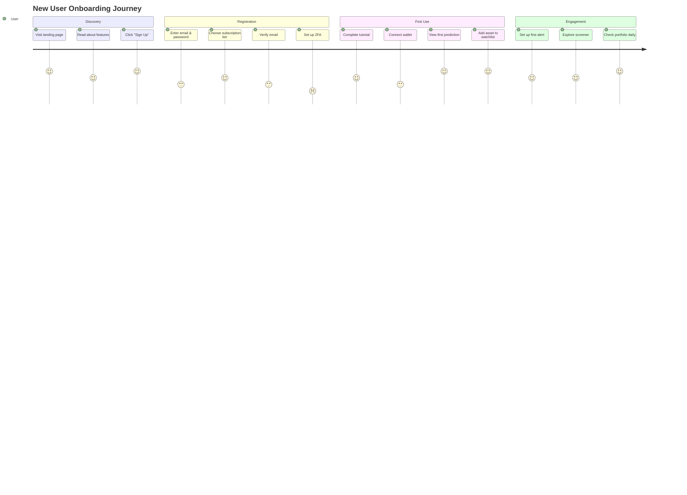

### Asset Analysis Flow

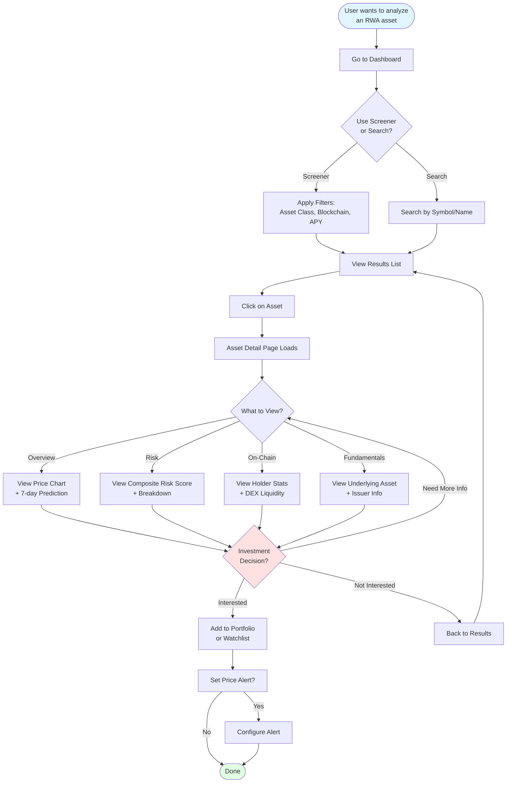

### Alert Lifecycle

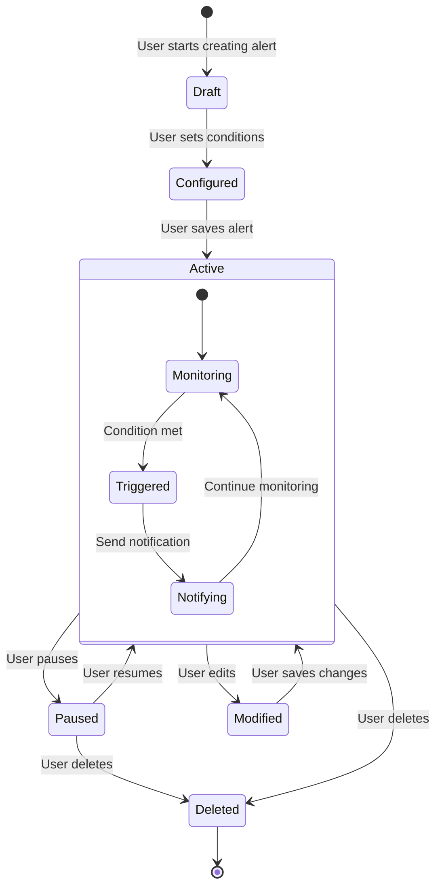

---

## CI/CD Pipeline Flow

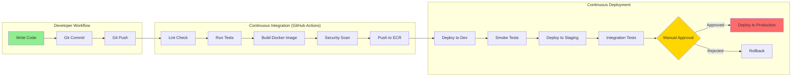

---

**Last Updated**: October 23, 2025
**Maintained By**: Development Team

**Note**: These diagrams are rendered using Mermaid. View this file in GitHub, GitLab, or any Mermaid-compatible markdown viewer for proper visualization.

**Related Documentation**:
- [ARCHITECTURE.md](./ARCHITECTURE.md) - Detailed architecture explanations
- [API_REFERENCE.md](./API_REFERENCE.md) - API endpoint specifications
- [DEVELOPMENT_GUIDE.md](./DEVELOPMENT_GUIDE.md) - Development workflows
